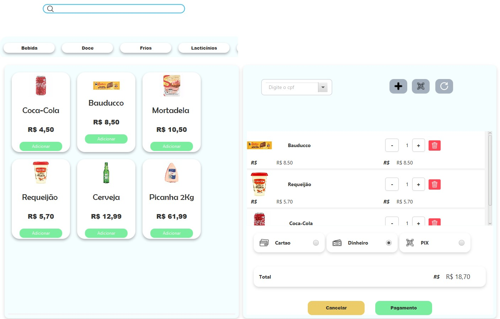
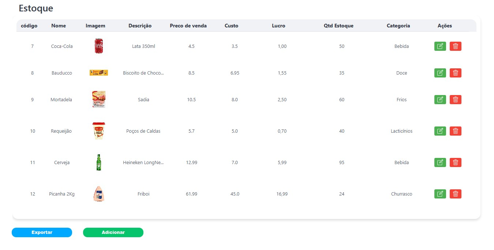
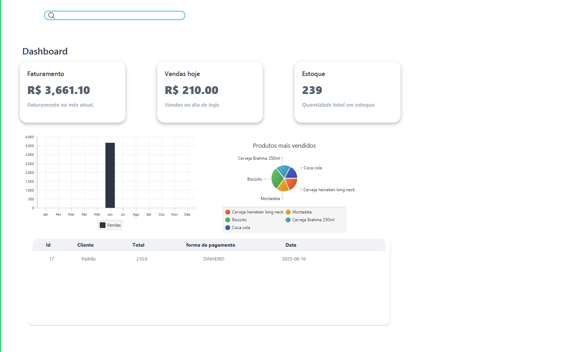
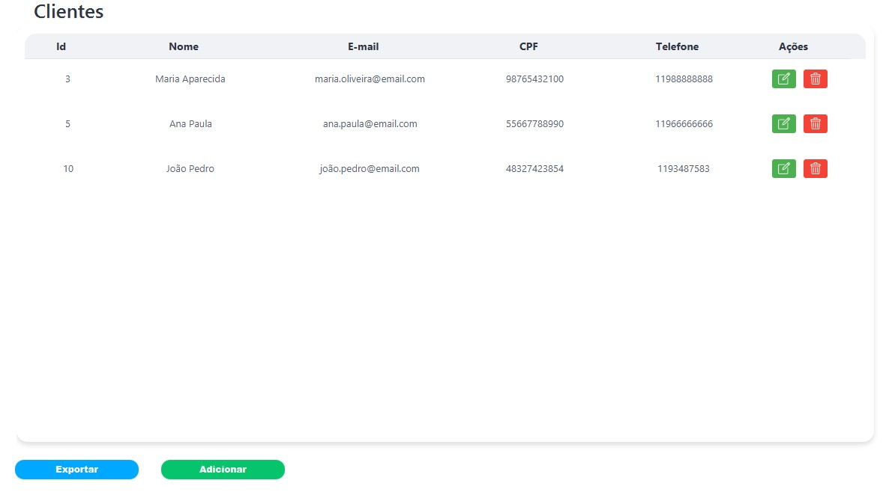
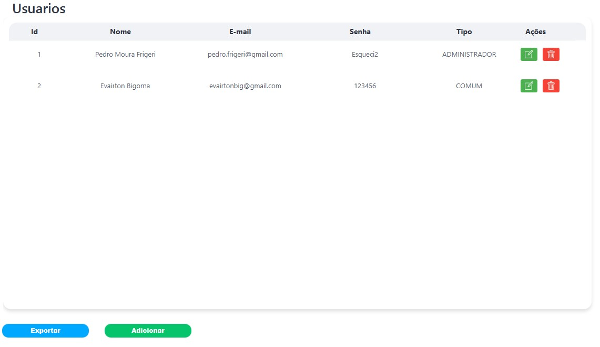
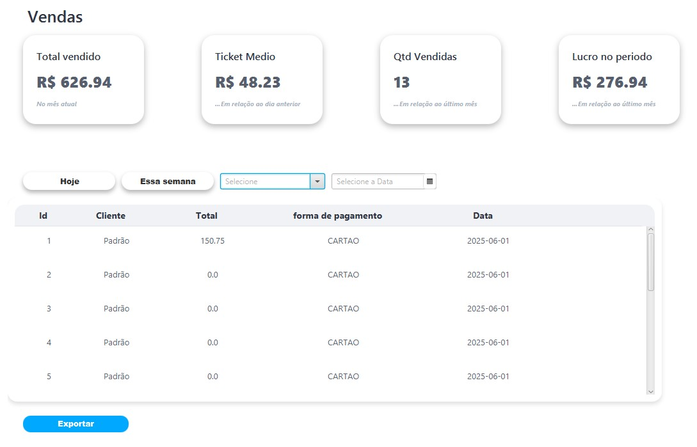
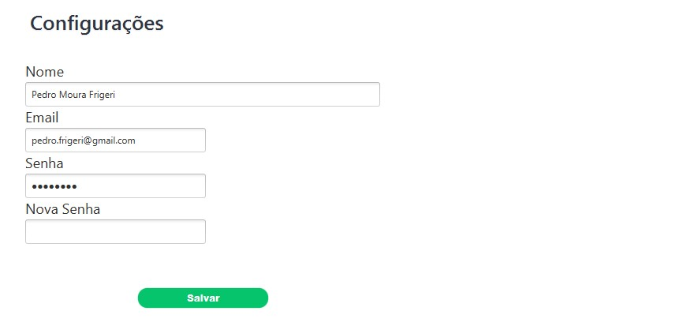

# 🛒 Delta PDV - Sistema de Ponto de Vendas  

**Projeto desenvolvido para fins acadêmicos**, simulando um sistema de PDV desktop funcional com interface gráfica (JavaFx) e integração a banco de dados via JDBC.

**Colaboradores:** Projeto feito com grande contribuição de https://github.com/pfrigeri

## 🛠️ Tecnologias Utilizadas  
- **Java**: Lógica de programação, Programação Orientada a Objetos e Arquitetura de Software Model View Controll (MVC).  
- **JavaFX (SceneBuilder)**: Interface gráfica (telas).  
- **JDBC**: Conexão com banco de dados para persistência.
- **MySQL**: Banco de Dados  

## ⚙️ Pré-requisitos  
- Java JDK 8 ou superior.  
- SceneBuilder (para edição das telas `.fxml`).  
- Banco de dados compatível com JDBC (ex: MySQL, PostgreSQL).

## 📂 Branch Principal
O desenvolvimento está sendo feito na branch `sistema`.

## 🖼️ Telas do Sistema
### Login
 
Autenticação de usuários.

### Ponto de Venda
 
Tela onde as operações de caixa são realizadas, tais como: busca de produtos no estoque, separados por categoria; escolha da forma de pagamento; transação final e emissão do comprovante de compra.

### Estoque
 
Interface para cadastro de produtos, possibilitando atualização, remoção e adição dos mesmos.

### Dashboard
 
A tela de Dashboard é o painel principal do sistema Delta PDV, exibindo informações estratégicas em tempo real para auxiliar na gestão do ponto de venda.
A interface é dividida em seções claras, com dados de faturamento, vendas, estoque e menus de navegação.

### Clientes
 
Registro editável das informações dos clientes, possibilitando atualização, remoção e adição dos mesmos.

### Usuarios
 
Registro editável das informações dos usuarios, possibilitando atualização, remoção e adição dos mesmos.

### Vendas
 
Registro de vendas 

### Configurações
 

Tela onde as informações do usuário são disponibilizadas para alteração.
